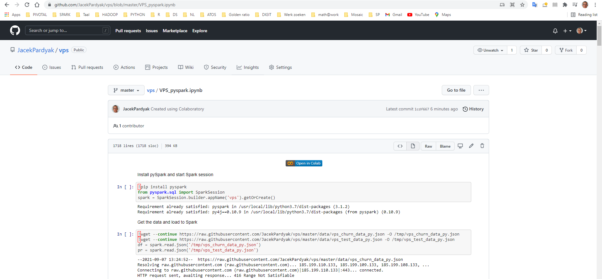

```{r setup, include=FALSE}
knitr::opts_chunk$set(echo = FALSE)
```

# Introduction

## Motivation

This is the continuation of the presentations:

- https://github.com/JacekPardyak/vps/blob/master/vps-part-1.pdf ,

- https://github.com/JacekPardyak/vps/blob/master/vps-part-2.pdf ,

- https://github.com/JacekPardyak/vps/blob/master/vps-part-3.pdf.

In this presentation we:

- demonstrate how to use **sparklyr** R interface for Apache Spark 

# Apache Spark

## Setting up Spark connection

```{r, warning=FALSE, message=FALSE, echo=TRUE}
library(tidyverse)
library(sparklyr)
#spark_install(version = "3.1")
sc <- spark_connect(master = "local")
connection_is_open(sc)
#spark_disconnect(sc)
```
```{r}
spark_version(sc)
```


##  Copy local data frames to a remote src

```{r, echo=TRUE}
vps <- read_csv("./data/vps_churn_data.txt") 
pro <- read_csv("./data/vps_test_data.txt") 
vps_tbl <- copy_to(sc, vps, overwrite = TRUE)
pro_tbl <- copy_to(sc, pro, overwrite = TRUE)
src_tbls(sc)
```

## Plot some data from Spark

```{r}
tbl(sc, 'vps') %>%
  #filter(is_churn == 0) %>% 
  ggplot(aes(disk_octets_write_mean_m_3, network_rx_max_gradient)) +
  geom_point() +
  geom_smooth()
```

## Plot some other data from Spark


```{r}
vps_tbl %>% ggplot(aes(disk_octets_write_mean_m_3, network_rx_max_gradient)) +
  geom_point() +
  geom_smooth()  + 
    xlim(c(0, 45))

```

## Data with outliers

```{r, eval=FALSE}
tbl(sc, 'vps') %>% collect()  %>% stack() %>% filter(ind == 'disk_octets_write_mean_m_3') %>% 
  ggplot(aes(x = ind, y = values)) + 
  geom_boxplot()

```
```{r, warning=FALSE, message=FALSE}
library(ggstatsplot)
tbl(sc, 'vps') %>% collect()  %>% stack() %>% filter(ind %in% c('disk_octets_write_mean_m_3')) %>%
  ggbetweenstats(ind, values, outlier.tagging = TRUE)
```

## Outliers removal

```{r, echo=TRUE}
var = 'disk_octets_write_mean_m_3'
tbl <- tbl(sc, 'vps') %>% select('id', all_of(var)) %>% collect() 
summary(tbl)

Q <- tbl %>% select(!! sym(var)) %>% pull() %>% quantile(probs=c(.25, .75), na.rm = FALSE)
iqr <- tbl %>% select(!! sym(var)) %>% pull() %>%  IQR()
#up <-  Q[2]+1.5*iqr # Upper Range  
#low<- Q[1]-1.5*iqr # Lower Range
proper <- tbl %>% filter((!! sym(var) > (Q[1] - 1.5*iqr) & (!! sym(var) < (Q[2]+1.5*iqr))))
```

## Data without outliers

```{r, warning=FALSE, message=FALSE}
proper %>% stack() %>% filter(ind %in% c('disk_octets_write_mean_m_3')) %>%
  ggbetweenstats(ind, values, outlier.tagging = TRUE)
```

## Using SQL

```{r, echo=FALSE}
library(DBI)
vps_preview <- dbGetQuery(sc, "SELECT * FROM vps LIMIT 10")
vps_preview
```

# Machine Learning

## Random forest, all vars, training & evaluation on all data

```{r, echo=TRUE}
rf_model <- vps_tbl %>%
  ml_random_forest(is_churn ~ ., type = "classification")
rf_predict <- ml_predict(rf_model, vps_tbl) %>%
  ft_string_indexer("is_churn", "is_churn_idx") %>% collect
table(rf_predict$is_churn_idx, rf_predict$prediction)
ml_evaluate(rf_model, vps_tbl)
```

## Random forest, all vars, evaluation on test data

```{r, echo=TRUE}
partitions <- tbl(sc, "vps") %>%
  sdf_random_split(training = 0.6, test = 0.4, seed = 888)
rf_model <- partitions$training %>%
  ml_random_forest(is_churn ~ ., type = "classification")
rf_predict <- ml_predict(rf_model, partitions$test) %>%
  ft_string_indexer("is_churn", "is_churn_idx") %>% collect
table(rf_predict$is_churn_idx, rf_predict$prediction)
ml_evaluate(rf_model, partitions$test)
```

## Correlations

```{r, message=FALSE, warning=FALSE}
library(corrr)
correlation_matrix <- vps_tbl %>% correlate(use = "pairwise.complete.obs", method = "pearson")  #%>% collect
correlation_matrix %>% shave() %>% rplot()

correlated_features = c()
for (col in c(2:ncol(correlation_matrix))) {
  for (row in c(1:col)) {
    coeff <- correlation_matrix[row, col]  %>% pull() %>% abs()
    print(coeff) 
    if( ! is.na(coeff) & coeff > 0.9){
      colname = names(correlation_matrix)[col]
      print(colname) 
      correlated_features = c(correlated_features, colname)
    }
  }
  
}

correlated_features
```


## Random forest, chosen vars, evaluation on test data

```{r, echo=FALSE}
features <- c( "cpu_load_mean_m_3",
               "disk_octets_read_mean_m_3",
               "disk_octets_write_mean_m_3",
               "disk_ops_read_mean_m_3",
               "disk_ops_write_mean_m_3",
               "network_rx_mean_m_3",
               "network_tx_mean_m_3",
               "cpu_load_monthly_mean_delta",
               "network_tx_monthly_mean_delta",
               "network_rx_monthly_mean_delta",
               "disk_ops_read_monthly_mean_delta",
               "disk_ops_write_monthly_mean_delta",
               "disk_octets_write_monthly_mean_delta",
               "disk_octets_read_monthly_mean_delta",
               "cpu_load_max_gradient",
               "disk_octets_read_max_gradient",
               "disk_octets_write_max_gradient",
               "disk_ops_read_max_gradient",
               "disk_ops_write_max_gradient",
               "network_rx_max_gradient",
               "network_tx_max_gradient" )

features <- setdiff(features, correlated_features)

formula <- formula(paste("is_churn ~ ", paste(features, collapse = " + ")))
#formula
```


```{r, echo=TRUE}
partitions <- tbl(sc, "vps") %>%
 sdf_random_split(training = 0.6, test = 0.4, seed = 888)
rf_model <- partitions$training %>%
  ml_random_forest(formula, type = "classification")
rf_predict <- ml_predict(rf_model, partitions$test) %>%
  ft_string_indexer("is_churn", "is_churn_idx") %>% collect
table(rf_predict$is_churn_idx, rf_predict$prediction)
ml_evaluate(rf_model, partitions$test)
```

# Python

## PySpark

```{r, echo=FALSE, out.width="100%", fig.cap = "In this Colaboratory notebook you will find a step-by-step guide on how to use PySpark for the classification of VPS customers."}

```

https://github.com/JacekPardyak/vps/blob/master/VPS_pyspark.ipynb

## H2O

```{r, echo=FALSE, out.width="100%", fig.cap = "In this Colaboratory notebook you will find a step-by-step guide on how to use H2O for the classification of VPS customers."}

```

https://github.com/JacekPardyak/vps/blob/master/VPS_H2O.ipynb

# Further steps

- discuss with domain experts: outliers detected, crossing variables for feature engineering

  